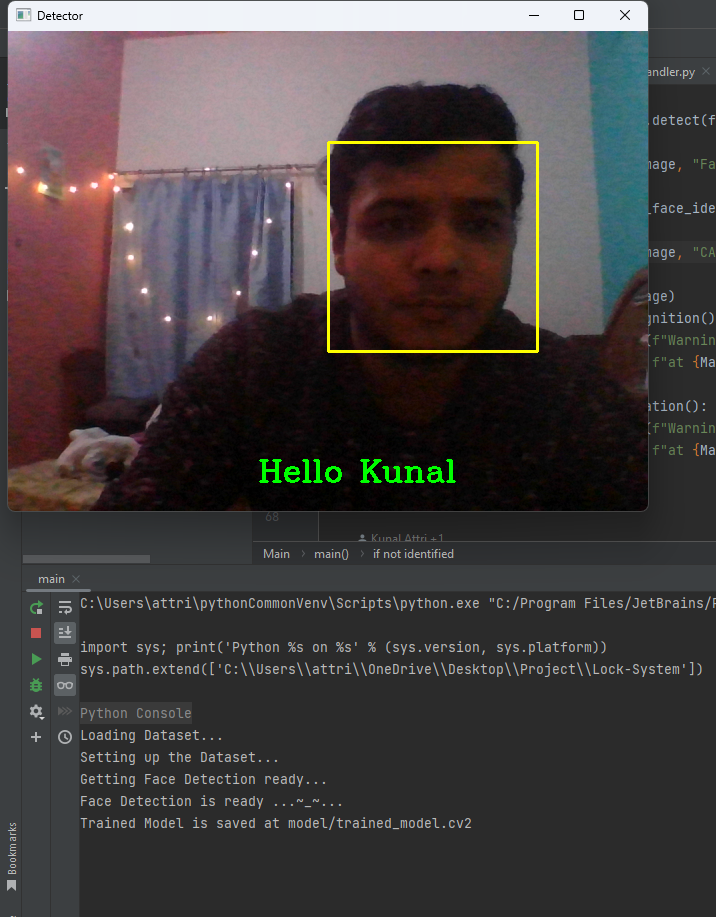
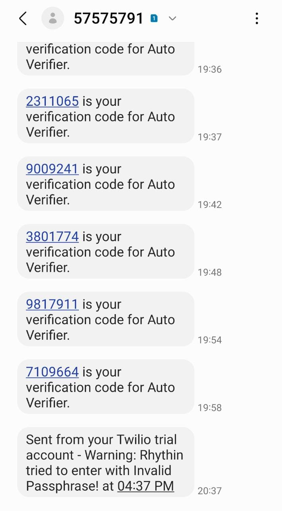
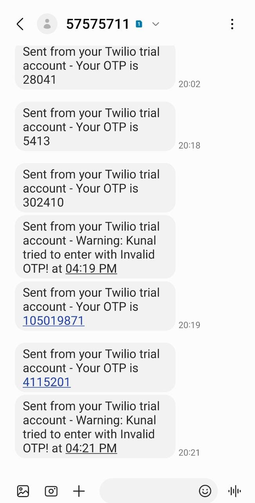

# Lock System with Multi-factor Authentication
Multi-factor Authentication refers to multiple levels and states of authentication for verification purpose. This
project tries to utilize that aspect through the use of Face Authentication, Speech Authentication and OTP Verification
for a lock based system. This can be further extended to utilize these capacities in other forms of Verification based
systems.

## Requirements (installable via pip)
- [opencv-python](https://pypi.org/project/opencv-python/)
- [opencv-contrib-python](https://pypi.org/project/opencv-contrib-python/)
- [numpy](https://pypi.org/project/numpy/)
- [pyttsx3](https://pypi.org/project/pyttsx3/)
- [SpeechRecognition](https://pypi.org/project/SpeechRecognition/)
- [twilio](https://pypi.org/project/twilio/)
- [PyAudio](https://pypi.org/project/PyAudio/)
  - Only in Windows systems
  - If you are on a linux system, install by:
    `sudo apt install python-pyaudio python3-pyaudio`

## What we used?
- [SpeechRecognition](https://www.geeksforgeeks.org/speech-recognition-in-python-using-google-speech-api/) - for 
verifying passcode - SpeechRecognition is a python library which we used to verify our passcode. The passcode is to be 
said by the user to proceed to the OTP verification Phase.
- [OpenCV](https://opencv.org/) - for Face Detection and Identification - OpenCV is a python library which we used to 
detect the face of the user using LBPH face recognition. Then it is further processed via our FaceIdentification model.
- [pyttsx3](https://pyttsx3.readthedocs.io/en/latest/) - for Speaking Text outputs - Python Text to Speech is a python 
library to convert text to speech form. We have used it make it convenient for end user to interact with the application.
- [Twilio](https://www.twilio.com/) - for Sending OTP & alert Messages - Twilio is a communications API for SMS, voice, 
video, WhatsApp messaging and email. We used this API to send and verify OTP by both as a web client and in the program 
itself.
- [json](https://docs.python.org/3/library/json.html) - for Dataset management - JSON library is used to interact with 
json files. We have used it to manage our dataset labels.

## How to run the program
1. **Download this GitHub repository**
	- Either Clone the repository
		```
		git clone https://github.com/Kunal-Attri/Lock-System.git
		```
	- Or download and extract the zip archive of the repository.

2. **Download & Install requirements**
	- Ensure that you have Python 3 installed.
	- Open terminal in the Repository folder on your local machine.
	- Run the following command to install requirements.
		```
		pip3 install -r requirements.txt
 		```
3. **Run Sampling App `Sampling.py`**
      - Form dataset of your face images
               
	        python3 sampling.py
      - *Expected Interface*
            
<br><br>
4. **Run CLI App `main.py`**

       python3 main.py 
      - *Expected Interface*
           
<br><br>
5. **Preparing Data Set** - Internally done
     - The collected data set from `sampling.py` is further formatted for training in `FaceIdentificationModel.py`.
     - Here the Image gets loaded, formatted and converted to grayscale.
     - Then it gets passed on to `__build_dataset` where the mathematical Dataset is made.
     
6. **Training model on the data set collected from `Sampling.py`** - Internally done
     - In `FaceIdentificationModel.py`, the function `__train_model` trains the Prepared Data set and gets the program ready for Face Detection using LBPH (Local Binary Pattern Histogram) Face Reecognition.

7. **Working**
     - **Face Detection**
        <br>
        
     - **Face Identification**
        <br>
        
     - **Passphrase Verification**
        <br>
        
     - **OTP Verification**
        <br>
        
     - **Messages received on Mobile**
        <br>
        
8. **References**
    - [Google Speech Recognition API](https://www.geeksforgeeks.org/speech-recognition-in-python-using-google-speech-api/) 
    - [LBPH Face Recognition](https://towardsdatascience.com/face-recognition-how-lbph-works-90ec258c3d6b)
    - [Twilio SMS](https://www.twilio.com/docs/sms)
    - [Twilio OTP Verification](https://www.twilio.com/code-exchange/one-time-passcode-verification-otp)
    - [pyttsx3 Engines](https://pyttsx3.readthedocs.io/en/latest/engine.html#examples)
    - [Your Black Dog](https://en.wikipedia.org/wiki/Black_Dog_Scotch_Whisky)

